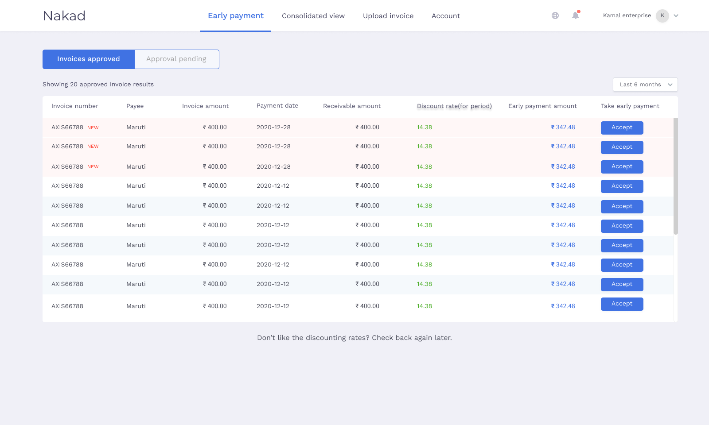
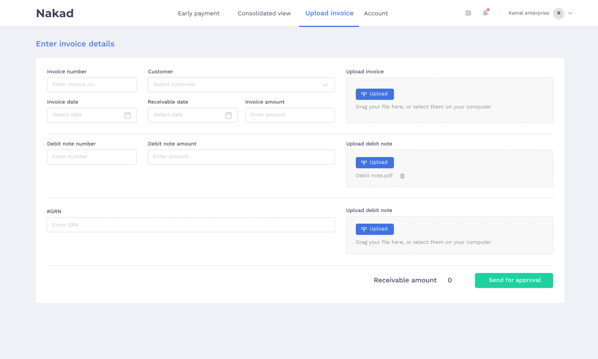
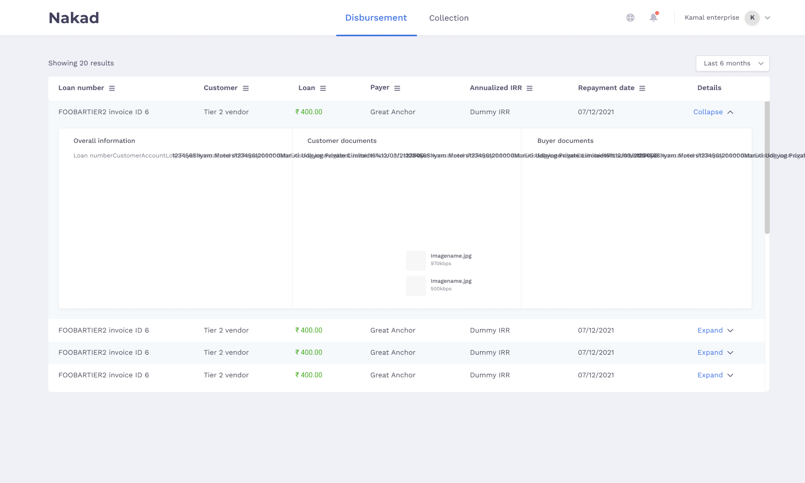

# Nakad

This repository is to show my Internship work that I have done for a startup. The whole front-end part using ReactJS Framework and AG Grid , authetication part using Passport.js and Express.js is done by me. I have also developed some API which are interacting with the Postgres DATABASE using TypeORM and Typescript.

This website is a accounting portal which facilitates the process of acquiring loans and thereby boosting production for tier-2
SME’s and MSME’s by tying up banks with tier-1 enterprises.

**Techstack Used: Typescript, ReactJS, Express.js, Passport.js, TypeORM, AG Grid**

### Some Portal Screenshots:

#Login Page:

#Early Payment Screen:

#Invoice & GRN Upload Screen:

#Bank Disbursement Screen:

